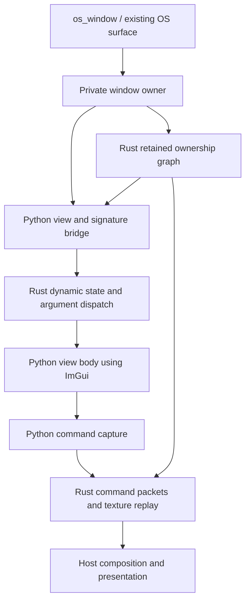

# Rust GUI prototype: implementation, coverage and development record

**Snapshot: 2026-10-09, after the public `gui` / `os_window` interface work.**

This is the detailed record of the throwaway Rust rendering experiment in
MeltyGUI. It describes the code that exists, the behavior verified so far, the
parts of production rendering it does not replace, and the reasons behind the
successive experiments. It is a development snapshot, not a production API or
compatibility promise.

The central result is a separation between **executing a Python view**, **updating
its cached pixels**, **reflowing layout**, and **maintaining window ownership**.
Those operations no longer have to travel together up the whole caller chain.
Rust makes the bookkeeping cheaper; avoiding unnecessary work is the larger
architectural opportunity.

## 1. Scope and orientation

There are three related experiments, with different purposes:

| Entry point | Purpose | Important distinction |
| --- | --- | --- |
| `examples/tile_manager.py --rust-gui` | Compare the native wrapper with `render_func`, using buttons, numbers and collections | An uncached wrapper experiment inside the existing rendering host; not the new retained compositor |
| `examples/tile_manager.py --rust-cache` | Exercise independent invalidation, returned edits and conditional owned windows | Uses retained commands and textures, with ordinary `@gui` functions under the existing OS-window host |
| `examples/tile_manager.py --rust-layout` | Exercise measured height, width changes, clipping and layout propagation | Side-by-side measured and fixed parents, with execution counters and geometry |
| `examples/example_ui.py` | Show the minimum public app interface | One import, one decorator, no required input parameter or return statement |

Production `core_render.render_func` remains available. Its blit implementation
and deferred window replay have not been replaced globally. The experiment uses
the existing OS-window lifecycle and selected integration points, while keeping
its own native view state and retained graph.

The original comparison widgets are local prototype implementations. The package's
existing `meltygui.draw_int`, `draw_float`, `draw_collection` and other production
exports have not silently become Rust implementations.

### Source map

| Source | Responsibility |
| --- | --- |
| [gui_prototype.py](../../meltygui/core/rendering/gui_prototype.py) | Public decorators, signature planning, typed injection recognition, native binding and active-window scope |
| [gui_window_prototype.py](../../meltygui/core/rendering/gui_window_prototype.py) | Private per-surface owner; dispatch, frame boundaries, input translation, flush, presentation and cleanup |
| [retained_gui_prototype.py](../../meltygui/core/rendering/retained_gui_prototype.py) | Python call bridge, ImGui contexts, argument comparisons, command capture, layout measurement, pointer regions and scheduling orchestration |
| [lib.rs](src/lib.rs) | Dynamic native state, field slots, call identities, dependency injection, native wrapper and timing |
| [retained.rs](src/retained.rs) | Retained identities, ownership, invalidation associations, pending results, dirty/composition flags, measured extents and portal ordering |
| [texture.rs](src/texture.rs) | Command packets, OpenGL textures/FBOs, replay, clipping, tint, alpha resolution and GPU cleanup |
| [app.py](../../meltygui/core/runtime/app.py) | Existing OS-window registration and dispatch to the experimental root adapter |
| [surface.py](../../meltygui/core/windowing/surface.py) | Existing surface lifecycle; owns and closes the private GUI owner before destroying its graphics resources |
| [rust_gui_demo.py](../../meltygui/examples/rust_gui_demo.py) | Original matching-body controls and collection benchmark |
| [retained_gui_demo.py](../../meltygui/examples/retained_gui_demo.py) | Independent redraw, scalar replay and conditional-window examples |
| [retained_layout_demo.py](../../meltygui/examples/retained_layout_demo.py) | Layout laboratory and its local injected model/state |

[README.md](README.md) remains the quick start and original benchmark record.
[RETAINED.md](RETAINED.md) is the shorter guide to the retained experiments.

## 2. Current application interface

The minimum app is runnable as written:

```python
from meltygui import os_window
import imgui

@os_window(name="example main", width=1400, height=1000)
def example_app():
    imgui.text("hello")
```

`@os_window(...)` is shorthand for `@gui(glfw_window=True, ...)`. That decorator
registers the GUI root through the existing `glfw_window` host. It discovers the
host's keyword-only options from its signature, rather than maintaining another
list of window settings. Name, initial size, app identity, settings and close
callback therefore continue through the existing lifecycle.

For an OS root, decorator width/height are initial window dimensions; restored
window geometry can take precedence. The root receives the actual current
surface extent when drawn. Ordinary cached child width/height arguments are
constraints on that call, not OS-window initial geometry.

Both decorators are public imports, and both support bare and parenthesized use:

```python
from meltygui import gui, os_window

@gui
def decoration(draw_state=None):
    pass

@os_window(name="Example")
def app():
    decoration()
```

The earlier `@glfw_window(...)` over `@gui(...)` form still works. Importing
`gui` or `os_window` does not open a display or load the optional native extension.
The native build is required when the GUI engine is instantiated for drawing.

### Input and return contract

- A function does not have to declare `input_value`.
- Named dependencies, typed state parameters and custom arguments still work
  when that parameter is absent.
- Returning `None`, including falling off the end of the function, becomes
  `(False, original_input_value)`. Caller-supplied object identity is preserved.
- An explicit `(changed, value)` return retains its editable-view meaning.
- An omitted call input is currently represented by `None`, with no separate
  omitted-value sentinel. A declared Python `input_value` default does not replace
  that injected `None`; supply the desired initial value explicitly when needed.
- A drawing-only parent that ignores a child's returned edit is not automatically
  rewritten into an assignment. Application code still consumes editable results
  where necessary.
- The call wrapper retains an optional leading `input_value` argument. This is
  not a general redesign of positional argument binding: named parameters and
  `**kwargs` are supported; positional-only parameters and `*args` are rejected
  when the native signature plan is built.

### Cache and frame defaults

Plain `@gui` and `@os_window` use the same default retained behavior. Use
`use_cache=False` for an immediate root or host UI such as live counters.
`live=True` on the window root requests continuous host frames. It does not mean
that every cached descendant executes on every frame.

The retained demos explicitly use an immediate, live root to show counters.
That is a demo choice, not a requirement for the minimum app.

There is no application-owned `GuiRuntime` class anymore. A private `_GuiWindow`
belongs to each OS surface. A plain public `@gui` function requires that active
window scope; calling it as an unrelated ordinary function outside a GUI host
raises a descriptive error.

**Window distinction:** the decorator's `glfw_window=True` registers an OS root.
Calling a retained child with `glfw_window=True` is still unsupported and raises
`NotImplementedError`. Internal experimental windows use `melty_window=True`.
The convenient root decorator does not establish native child-window parity.

## 3. What runs in Rust and what remains Python



Rust owns the native state storage, wrapper registry and identities, argument
resolution, owned injected values, basic measurements, retained graph, result
mailboxes, dirty flags, portal order, command storage and OpenGL replay.

Python still owns the view bodies, signature inspection, bridge dictionaries,
the loop that asks the graph for work, ImGui context switching, command-buffer
extraction, pointer hit testing and host integration. Drawing primitives still
go through the existing Python ImGui extension. The wrapper also still constructs
Python argument dictionaries and calls Python functions.

This is not a port of all rendering into pure Rust. There is no direct new
Rust-to-ImGui C++ interface, no GIL-free view execution and no parallel render
thread. Native classes are thread-bound, and graphics work stays on the render
thread with an active GL context.

## 4. Dynamic fields and dependency injection

### One storage mechanism for all fields

Each native runtime has a field-name-to-slot table. A native state stores values
in a slot-indexed vector. Framework fields and newly introduced user fields use
that same mechanism; custom fields do not fall back to a separate slow dictionary.

Stored values distinguish `None`, exact Python booleans, signed 64-bit integers,
floats and arbitrary Python objects. Integers outside the native range, numeric
subclasses and other Python objects retain Python references. This preserves
specialized types and object identity where unboxing would change their meaning.

Native state supports attribute reads, writes and deletion, `get`, `as_dict`,
and a revision counter. Writes can preserve authored parameter values underneath
temporary caller overrides. The revision counter is not, by itself, a connection
to retained invalidation: writing state outside an execution does not magically
wake its view.

The mechanism is dynamic, but not free. Name lookup, Python reference management,
argument dictionary construction and Python/native crossings remain. The shared
field table also accumulates names, and sparse use of many unrelated fields can
inflate per-state storage. No JIT specialization or equivalent fixed-field
benchmark has established the exact dynamic-storage premium.

### Signature planning and value resolution

Python inspects a function's signature when it creates a binding. Typed
`DictConversion` parameters with suitable defaults receive per-view factory
injection. `inject={"parameter": factory}` supplies additional factories.

For ordinary declared dependencies, resolution considers an explicit caller
argument, a value authored on the native state, available decorator/frame
arguments, an owned factory-created value, and the function's default. A required
unresolved parameter raises an error. Functions without `**kwargs` receive only
their declared arguments; functions with `**kwargs` can consume extra fields.

Caller-supplied state is borrowed rather than substituted for the runtime's
owned instance. Tests verify that caller overrides are transient, owned objects
remain independent between views/windows, and callbacks can nest without holding
an incompatible Rust borrow over Python execution.

At the mechanism level, introducing a custom argument does not require editing
a fixed framework field registry. This does not remove the project's ownership
guidelines: reusable feature state should still live in an appropriate injected
state object rather than accumulating arbitrary feature fields on draw state.

### Identities and keys

The wrapper's identity includes its runtime scope, parent, renderer and key.
The retained graph separately identifies a call by ownership parent, renderer
and key. A retained call defaults its key to the function name; repeated calls
to the same renderer under one owner should use explicit distinct stable keys.
Duplicate declarations with the same identity during one owner execution fail.

Keys are ordinary hashable Python keys. Using hash tables for names and IDs is
different from hashing model contents to detect mutations; the latter is not used.

**There are currently two ID spaces.** `draw_state.unique` is native-runtime
local. `cache.current` is the retained graph node ID. A separate native runtime
per cached node means these numbers must not be treated as interchangeable or
globally unique. For targeted retained invalidation, store `cache.current`, or
associate/invalidate the draw-state object itself. Unifying those identities is
production work still to be done.

## 5. Retained ownership, invocation and invalidation

A retained node stores its input/caller relationship, current keyword arguments,
last result, declaration children, requested constraints, assigned rectangle,
portal status/order, execution count, associations and dirty/composition flags.
The Python bridge retains the callable, native binding and ImGui context.

### Supported invalidation paths

| Signal | Current behavior |
| --- | --- |
| `cache.invalidate_id(cache.current)` or a saved retained ID | Marks that retained node for execution |
| `cache.invalidate(model)` | Marks nodes associated with that object identity |
| `cache.associate(path_or_object)` inside a body | Adds an explicit association to the current node |
| `cache.invalidate(path)` | Uses the supplied string/path spelling as an association key |
| `cache.invalidate(draw_state)` | Finds nodes associated with that native state object |
| `cache.invalidate(view_function)` | Invalidates associated instances; the public decorator resolves to its underlying function |
| Changed caller arguments on a call | Invalidates according to primitive value or object identity comparisons |
| `(True, value)` from a view | Stores a pending returned edit, propagates through callers, and invalidates other associated users of its input |
| Retained pointer event | Queues fresh `view_events` and dirties its receiver |
| Python function code replacement | Refreshes the native plan and invalidates associated retained instances |

Input values, view functions and native draw states receive automatic associations.
An arbitrary object supplied through an unrelated keyword or owned typed-state
parameter is not automatically a complete dependency declaration; use
`cache.associate` where an external invalidation must find that view.

Object associations use identity and retain anchors for their lifetime. Path
associations are lexical supplied strings, not file-content hashes, filesystem
watchers or automatic canonical-path equivalence. A replaced input removes its
old association when the bridge updates the invocation. Retirement removes
node associations and resources, though ordinary external references or function
closures may of course continue to retain Python objects.

Exact primitive call arguments are compared cheaply by value; arbitrary Python
objects use identity. Dictionaries, lists, models and files are not recursively
hashed or traversed to discover changes. Mutating an object silently is not an
invalidation signal.

### Independent execution and conditional lifetime

Dirty functions can execute from their saved invocation without executing their
ancestors. Dirty work is ordered by ownership depth so an invalidated owner can
withdraw a child before separately queued child work runs.

A successful owner execution commits its new declaration set. Omitted children
and their entire owned subtrees are retired. A cache hit preserves the previous
declaration set. The immediate host applies the same reconciliation to root calls.

For the original lifetime problem, the required sequence is:

```python
# Pseudocode: the function owning the condition must receive invalidation.
model.closed = True
cache.invalidate(model)  # when that model is associated with the owner

# The owner executes despite its cached ancestors.
if not model.closed:
    content(melty_window=True)
# No declaration this time: retire content and its owned subtree.
```

This is not unconditional polling of all window owners. A silent mutation cannot
be discovered automatically. Also, replaying a saved child invocation cannot
recompute an arbitrary expression originally evaluated in its caller. Invalidate
the caller when that expression or conditional needs reevaluation.

### Returned-value replay

An independently executed editable child may produce a new scalar before its
caller runs. The graph keeps that result in a pending mailbox. The caller wakes,
reaches the ordinary child call and receives the edit there, so normal assignment
and upward `(changed, value)` propagation remain meaningful.

A stale scalar echoed by the caller cannot overwrite the independently produced
value. A pending result is consumed once. Subsequent pixel-only redraws start
from the live value, not the pre-edit caller argument. A signalled refresh may
also rerun a caller to update text it drew before assigning the returned value.

Pending-value protection does not freeze layout/style arguments: new width or
other arguments still have to take effect while the edit is waiting. A regression
test now covers that combination explicitly.

### Failure handling

An exception unwinds native/ImGui scopes and preserves the owner's previously
committed declaration set. Newly introduced declarations from the failed attempt
are retired, and the node remains eligible for retry. Events from the attempt
are put back for retry by the bridge.

This is not transactional rollback of arbitrary Python. Model mutations, external
side effects and modifications to existing child nodes are not undone. Event
handlers that mutate state and then raise therefore need particular care.

## 6. Command capture, textures and composition

### Capture and replay

Each cached node currently owns a private ImGui layout context sharing the host
font atlas. On execution, the bridge activates that context, runs the Python body
through the native wrapper, finalizes ImGui draw data, and copies vertex, index
and command buffers into Rust-owned packets.

These are retained drawing commands, captured before parent composition. The
system is not trying to recover a child's image by copying pixels out of an
already flattened parent framebuffer.

Rust replays the packets into private GL textures. Inline child calls record
images referencing stable child texture names. Resizing reallocates the storage
behind a texture name rather than replacing the name. Parent packets can keep
their child references; when geometry changes, the layout owner generates new
placement commands as necessary.

Dirty textures are replayed bottom-up after execution/layout settles. Clean
textures are reused. This avoids ancestor Python execution for a pixel-only
child update, but does not make that update zero-cost: containing textures may
still require GPU replay along the composition chain.

### The operations deliberately separated

| Change | Python work | Rendering work |
| --- | --- | --- |
| Clean cached view | No cached body execution | Reuse its texture |
| Child pixels change, extent unchanged | Execute child | Replay affected containing textures |
| Child assigned extent changes | Execute child and necessary layout owners | Resize affected targets and replay updated composition |
| Child returns an edit | Execute callers needed to consume/propagate the result | Update resulting dirty textures |
| Portal moves or changes z order | No cached body execution solely for movement | Reposition/order the existing texture |
| Owner removes a declaration | Execute the invalidated owner | Retire child resources and stop presenting it |

### Alpha, backgrounds and clipping

Replay accumulates into a scratch target, then resolves premultiplied accumulated
colour into the straight-alpha representation expected when an ordinary ImGui
image samples the texture. Without that step, nested caches multiply alpha again
and darken translucent content.

Per-command clip rectangles are applied during replay. Inline child images are
also constrained by their containing cached geometry. Pointer-region tests obey
the same ancestor bounds. Portals escape inline ancestor clipping.

An RGB/RGBA `tint` tuple supplies a background over the final assigned extent.
It is applied during native replay, after measurement, with premultiplied clear
colour before the straight-alpha resolve. This is the small prototype tint path,
not parity with the full production styling/Tint system or HDR rendering.

### Internal windows as portals

An internal window is an ownership child but a separate composition portal. Its
texture is not baked into its declaration owner's texture. The compositor walks
the graph's current window inventory in z order and draws title, shadow and body.

The prototype supports title dragging and raising an overlapping portal. Removing
its declaration removes its presentation, shadow and interaction regions along
with its subtree. There is no separate blindly replayed window-call registry that
can outlive the graph's ownership decision.

Portal placement is now parent-relative through ordinary views. Retained
rows/columns, resize gestures and native/display collision constraints are
implemented in the next experiment, described in [COLLISIONS.md](COLLISIONS.md).
Docking and native child OS surfaces remain outside this compositor.

### Resource lifetime and cost

- Removed nodes release their packets, GPU targets, ImGui contexts and node-owned
  Python/native state. OS-surface shutdown closes the GUI owner before the shared
  renderer/font resources disappear.
- The default texture/scratch budget is 256 MiB. Exceeding it raises an error;
  there is no eviction that might invalidate a retained texture reference.
- Target dimensions are bounded to 8192 pixels per axis. A logical zero-height
  node uses a one-pixel-high backing texture.
- Runtime replay does not read textures back to the CPU. Tests do readbacks for
  verification.
- Retained packets still upload buffers during replay. There is no GPU-resident
  command-buffer pool, partial texture update system or damage-rectangle renderer.
- The reported texture-byte counter covers node targets, not all graphics memory;
  scratch storage, driver overhead and ImGui contexts also have costs. Command-byte
  reporting counts vertex/index data, not every metadata allocation.

## 7. Layout invalidation and measurement

### Current layout contract

| Option/state | Meaning |
| --- | --- |
| Explicit `width` | Assigned width constraint; checked and rounded to pixels |
| `width=None` | Remaining parent width at the call position, or available host width |
| Explicit `height` | Assigned height, subject to configured bounds |
| `height=None` | Measure content height |
| `min_height`, `max_height` | Bound the assigned extent; defaults are 0 and 8192 |
| `content_height` | Measured ImGui content extent |
| `draw_state.height` after execution | Assigned/clamped height |
| `return_extras=True` | Return the native draw state alongside changed/value for callers that need it |

Widths remain constrained. There is no intrinsic-width solver or general solver
for mutually dependent widths and heights. Regular ImGui cursor placement and
`same_line` allow the experiment to exercise vertical and horizontal flow.

A retained component defaults to width 300 and height 100 unless overridden;
content measurement is explicit through `height=None`. OS-root dimensions come
from the host rather than these component defaults.

Raw draw-list primitives do not reserve layout space automatically. Views using
them must also submit an item extent, for example `imgui.dummy(width, height)`.
Wrapped text uses the current width and contributes its measured height.

### Execution sequence

1. **Run using current constraints.** The graph keeps requested constraints
   separate from assigned output. An automatic-height capture uses a large
   logical viewport so the previous small texture cannot clip new content.
   This is not an up-front allocation of an 8192px-high texture.
2. **Measure once.** The native wrapper measures the ImGui group. The bridge
   applies min/max bounds, allocates/resizes the final backing target and captures
   commands. There is no separate measure-only invocation of user code.
3. **Compare extents.** Rust compares the assigned width/height with the previous
   assigned extent. A real inline size change invalidates the immediate layout
   owner. An owner currently executing consumes the new size at its call site
   instead of being redundantly rescheduled.
4. **Reexecute necessary layout owners.** An owner uses cached child extents to
   place siblings. Clean sibling bodies do not execute just because their
   positions move. Propagation continues upward only if the owner's own assigned
   extent changes.
5. **Settle and compose.** After dirty execution converges, textures replay
   bottom-up. Root calls settle before reserving space for later immediate-host
   items. A later extent change also requests a host frame.

Fixed or clamped parents therefore stop layout execution from spreading upward
while still allowing their pixels to be recomposed. Growing content can overflow
and be clipped inside a fixed parent without growing the outer layout.

A portal occupies no inline space, so its size change does not automatically
invalidate its declaration owner. That is correct for ordinary portal placement,
but not a promise to infer every custom dependency: an owner explicitly reading
portal geometry for unrelated layout must arrange its own invalidation.

### Why the immediate owner executes

The parent is arbitrary Python. It may use a child's size to position a sibling,
choose a branch, or generate a label/background. Merely shifting texture quads
cannot reproduce every such decision. The current design reruns that immediate
consumer and stops propagation at unchanged extents. Avoiding that execution
would require a more restrictive declarative layout representation or additional
dependency tracking; it is not assumed to come for free from Rust.

### Measurement gotchas

- During an auto-height body, `draw_state.height` is the previous assigned height
  or a provisional first-use default. It is not a prediction of the new height.
  Use content layout for measurement and the framework `tint` for a background
  that must cover the final extent.
- Self-referential layout based on the same view's unknown final height is not
  solved by this prototype.
- ImGui snaps measured item extents to pixels. Explicit fractional constraints
  are rounded upward; measured extents follow ImGui's result. Those are not the
  same rounding rule.
- Empty content has logical height zero, despite needing nonzero texture storage.
- A stationary pointer must be retested after reflow. The bridge resets its
  previous-pointer shortcut when retained hit geometry changes.
- A finite convergence guard is still necessary for feedback loops. Its limit is
  `max(64, 2 * number_of_records + 1)`, allowing deep legitimate propagation.
  Errors report outstanding function names, node IDs, geometry and recent changes.
- `cache.layout_log` retains the last 64 extent changes for diagnosis. This is
  prototype instrumentation, not a production dependency inspector.

## 8. Input, state changes and hot replacement

Retained bodies register local hit rectangles with `cache.region`. An uncached
host adapter samples pointer state, hit-tests the current geometry and queues
`view_events`. Events are freshly injected for execution; they are not frozen
inside the saved invocation. Hover changes invalidate the affected control's
pixels, so those transitions legitimately increment body counters.

The prototype claims gestures through the existing host input router when an
interactive ImGui item, explicit retained region or internal window owns the
interaction. A cached view rectangle selects where IO goes; it does not by
itself claim a host gesture. Text and empty layout space allow native background
movement. Ordinary widgets keep left drags while unclaimed right and
double-right drags reach the existing native resize/edge system.

The native wrapper also has an event-injection path used by the original
comparison host. That is not full integration of the retained compositor with
all production events.

### Ordinary ImGui widgets

`from meltygui import os_window` followed by `import imgui` now uses the same
`meltygui_imgui` native runtime as the host. Importing either prototype decorator
installs a narrow import bridge for `imgui` and its submodules without loading GL
or starting a display. Already-loaded upstream `imgui` is rejected with an
import-order explanation; silently mixing contexts would be unsafe. The
namespaced `from meltygui import imgui` interface remains available.

The exact minimum app with `imgui.text("hello")` works without `input_value`, a
return statement, cache configuration or a widget registration step. Native
group measurement includes ImGui item extents, and Rust captures/replays their
draw lists through the existing texture path. No Rust ABI change was required.

`gui_imgui_input.py` routes host IO into the private contexts:

1. Hit-test committed view bounds and ancestor clips, respecting portal order.
   Invalidate the previous and current pointer targets on position/button/wheel
   changes. This operates on complete view rectangles, even text-only views;
   there is no widget catalog or instrumented `imgui.button` wrapper.
2. Capture pointer presses to the hit node until release, including release
   outside the view. Focus its context for keyboard input. A focus change also
   delivers an outside click to the old context to deactivate its text field.
3. Copy local pointer coordinates, button/key states, modifiers, key mapping,
   delta time and font scale before `new_frame`. The window backend forwards
   character callbacks to its own cache, independent of which context happens
   to be current. Clipboard callbacks use the owning host backend.
4. Consume text and wheel input once per node per host sample. Extra executions
   caused by layout/returned-value propagation do not type characters twice.
5. Request further frames while text editing or an active held interaction can
   change its pixels with time. Otherwise retain the texture. Active editing
   can therefore run at the host frame rate; a still-hovered idle view does not.
6. Clear focus/capture on retirement and detach the backend callback on close.
   Clear private clipboard callbacks before destroying contexts so the binding's
   callback table does not keep the host backend alive.

Verified widgets include text, button, checkbox, float slider, input text,
Backspace, clipboard paste and wheel scrolling inside an ImGui child. A native
child can return `(changed, value)` normally; the existing retained mailbox
replays that edit to its caller without duplicating the widget action.
`examples/gui_imgui_widgets.py` demonstrates injected state for widgets whose
application values need to persist across body executions.

Still missing: cross-context Tab/focus navigation, OS-focus/IME integration,
cross-context drag/drop, production shortcut arbitration, and accessibility.
Popups extending outside a node's texture are clipped and are not promoted into
compositor portals. Root cached boundaries still do not implement scrolling;
an explicit `imgui.begin_child` can scroll within its allocated texture. Widget
support does not imply that every ImGui API has been validated.

Replacing a Python function's code refreshes its signature plan while preserving
native identities and owned state. The retained bridge detects changed code and
invalidates corresponding instances. Tests exercise code/signature replacement.

End-to-end source-file watcher integration for the new decorator is not established
by those tests. It should not be inferred from successful direct `__code__`
replacement. Native extension reload and migration of native state across compiled
engine versions are not implemented. Rebuilding the extension requires a new
test-app process to use the new engine. The build installs by atomic replacement
so an existing process's loaded library mapping is not overwritten in place.

## 9. Feature coverage versus core_render

"Implemented" here means the stated prototype behavior, not production parity.
Some facilities are supplied by the existing host rather than reimplemented.

| Area | Current coverage | Missing or deliberately limited |
| --- | --- | --- |
| Public app interface | `gui`, `os_window`, optional input parameter and implicit unchanged return | New decorator remains experimental |
| OS lifecycle | Existing GLFW/Wayland root host, configuration and surface-owned cleanup | No retained native child-surface integration; no new mobile backend |
| Dynamic state | Uniform slots for arbitrary names, native primitives and Python references | No persisted native sessions, state-version migration or fixed-field performance comparison |
| Injection | Signature filtering, `**kwargs`, typed `DictConversion`, explicit factories, caller overrides | No complete production parameter-link invalidation or arbitrary positional signature support |
| Identity/lifetime | Scoped IDs, stable keys, declaration reconciliation, subtree retirement | Separate wrapper/retained ID spaces; not a persistent ID format |
| Change detection | Explicit changed returns, identity/path/state/function associations, primitive call comparisons | No automatic observation of arbitrary in-place mutations; no file watchers implied by a path association |
| Returned edits | Independent child result replay, once-only consumption, stale-echo protection | Application must consume results correctly; arbitrary caller expressions need caller execution |
| Caching | Rust command packets, stable textures, independent execution, bottom-up composition | No production `BlitOffscreen` parity, eviction, partial damage updates or GPU-resident command-buffer pool |
| Layout | Measured/bounded height, constrained width, flow, clipping, retained row/column constraints and optional frozen-child resize replay | No intrinsic-width solver; production tile/scrollbar overlays and virtualization are not adapted |
| Windows | Owned portals, conditional lifetime, subtree z order, parent-relative placement, resize and collision prototype ([details](COLLISIONS.md)) | No docking or child OS windows; production tile overlays are not adapted |
| Input | Retained regions plus ordinary ImGui widget IO, click focus/capture, text/key input, clipboard, child scrolling and active-edit refresh | Cross-context navigation, OS-focus/IME, production shortcut arbitration, drag/drop and accessibility; view-bounds routing is coarse |
| Styling | Basic local drawing, width/height geometry, final-extent RGB/RGBA tint | Full production shared styling, theme/font invalidation, DPI transitions and HDR parity |
| Type rendering | Local prototype flat button, int, float and nested collection examples | No replacement of general dispatch, codecs, conversion chains or all specialized renderable types |
| Editor features | No broad reimplementation | Undo, search, collection drag reordering and production editor tooling remain with the existing system |
| Hot replacement | Native binding reconfiguration and retained invalidation on Python code replacement | Complete watcher integration and compiled-engine state migration unverified/unimplemented |
| Mixed old/new trees | Original benchmark hosted inside legacy panels; new roots use their own adapter | Arbitrary alternating old/new cached subtrees are not established |
| GPU commands | Ordinary ImGui texture commands, clip rectangles and index offsets for this build | Custom draw callbacks, nonzero vertex base offsets and arbitrary external texture lifetime management |
| Platforms | Desktop OpenGL exercised on Linux through native Wayland and GLFW | No claim of Windows, macOS, mobile, alternate graphics-backend or CUDA/tensor parity |
| Scale | Counters, bounded texture budget and semantic stress checks | Per-node contexts, Python scans and graph scans are not a production-scale architecture yet |

The current command capture assumes this ImGui build's 20-byte vertices and
32-bit indices. External textures and the shared font atlas must outlive packets
that reference them. Font/atlas regeneration needs explicit invalidation and
resource-lifetime integration.

This table compares responsibilities across `core_render` and its collaborating
core systems; it does not claim every listed production facility lives entirely
inside the `core_render.py` file.

## 10. Development sequence and findings

### Step 1: establish the scope

The starting proposal was an alternative to `render_func`, developed alongside
it, to reduce accumulated wrapper overhead without rewriting application views
in Rust. Dynamic caller/function arguments and dependency injection were explicit
requirements. A fixed list of fast framework fields plus a slower custom-field
escape hatch was not the intended design.

### Step 2: native wrapper and matching controls

The first experiment introduced PyO3 native state/dispatch and local `@gui`
versions of flat button, integer, float and collection rendering. The tile-manager
test app provided practical side-by-side comparison. A headless harness then
compared matching bodies with cache replay disabled.

This demonstrated substantial headroom for the smaller native wrapper. It did
not establish the performance of an equivalent production feature set.

### Step 3: retained commands instead of extending the old blit class

The next experiment retained draw commands and textures in Rust. The design
separated child ownership from composition order, particularly for windows.
The important lifetime failure being addressed was a replayed window surviving
after the condition declaring it changed inside a cached parent.

The resulting graph allows an invalidated owner to execute independently,
reevaluate its condition and retire omitted windows. Clean owners are not polled.
Returned-value replay was included so editable views remained meaningful.

### Step 4: remove application runtime ceremony

The first retained app explicitly managed a `GuiRuntime` and frame lifecycle.
That application-facing object and view-factory setup were removed. The existing
`@glfw_window` surface became the owner of private native/cache state, input,
frame boundaries and cleanup. The demo became module-level render functions.

An integration check exposed a gesture bug: an internal title drag could also
move the outer OS window. Registering the retained gesture with the host router
fixed the competing capture while preserving ordinary background movement.

### Step 5: measured layout and propagation

Fixed-size boundaries were relaxed to measured/bounded height with constrained
width. The layout laboratory made two otherwise similar trees visible side by
side: a child size change propagates through a measured parent, while a fixed
parent keeps its outer Python layout cached and clips the content.

The rendering checks were strengthened from counters alone to comparisons of
incrementally updated GPU textures against a newly rendered reference scene.
Coverage includes 80 seeded transitions and an 80-level layout chain.

Specific findings and fixes:

| Finding | Consequence or fix |
| --- | --- |
| Measuring inside the old texture's clip truncates growth | Use a large logical measurement viewport and allocate only the final target |
| Requested height and measured height are different state | Store constraints separately, avoiding spurious invalidation on the next declaration |
| Unchanged extents do not require ancestor layout execution | Keep execution dirtiness separate from composition dirtiness |
| Moving siblings need not run their bodies | Regenerate the owner's placement commands using cached child textures |
| Removed owners can supersede queued child work | Process ownership order and reconcile declarations before executing withdrawn children |
| A fixed 64-pass cap rejects a valid deep chain | Scale the convergence bound with graph size and add useful diagnostics |
| A pending returned edit could freeze old width arguments | Protect the pending value while accepting fresh caller layout/style arguments |
| Auto-height backgrounds drawn from the previous height leave uncovered space | Apply tint over the final extent during native replay |
| Nested straight/premultiplied alpha conventions can darken output | Resolve accumulated alpha before sampling through ordinary ImGui images |
| ImGui measurement rounds differently from explicit constraints | Assert measured pixel extents rather than assuming `ceil(raw_dummy_height)` |
| OpenGL can reuse a deleted texture name immediately | Verify retirement by node ownership/resource maps, not only by whether that integer names a live texture later |
| Unchanged pointer coordinates can refer to a different child after layout | Invalidate the previous-pointer shortcut when geometry changes |

### Step 6: minimum app interface

The public interface was reduced to `from meltygui import os_window` and a single
decorator on a zero-argument function. `os_window` selects the existing host
through `gui(glfw_window=True)`. `gui` also became a direct public import.

Input parameters were made optional at the function-definition boundary, and
native result handling now normalizes `None` into an unchanged result. Tests
verify this with caller-owned values, custom arguments, typed injected state,
cached/immediate functions and explicit editable child returns. Public imports
are checked not to boot the GUI or eagerly load the native extension.

### Step 7: ordinary ImGui widgets

The same public app can now call `imgui.text` and interactive ImGui controls.
The existing native draw-list capture already handled their pixels; the work
was connecting a shared binding and routing host input into retained contexts.
No per-widget API wrappers or permanent cache bypass were added.

Findings during implementation:

- Upstream `imgui` and `meltygui_imgui` have different native globals. The
  standard import must resolve to the host binding before executing widgets.
- Retained capture windows previously used `WINDOW_NO_INPUTS`. Removing it
  alone is insufficient: each private context also needs translated host IO.
- Focus changes between contexts need an outside click in the old context and
  a subsequent release; otherwise its text editor stays active or its next
  click is missed.
- Layout and returned-result convergence can execute a view more than once per
  host frame. Character queues and wheel deltas therefore need consumption
  bookkeeping separate from held button/key state.
- The binding's clipboard getters consult the *current* context even when
  accessed through a saved IO object. Use the owning backend's callbacks, and
  remove their references before destroying the private context.
- The old minimum-app test used a graphics-disabled host. Once its body called
  real ImGui, it needed a text spy; actual drawing is checked separately with
  a real GL context and texture pixels. ImGui calls without a frame can crash
  at the native boundary instead of raising a Python exception.

### Step 8: stop cached ImGui views swallowing host gestures

The first widget adapter registered both left and right drags over every cached
view rectangle. That prevented the surface's existing background move/resize
handlers from receiving them. The collision solver was already running; this
was an input-ownership problem, not a missing native edge solve.

Ownership is now registered after dirty contexts execute, using ImGui's actual
hover/activation state. Ordinary widgets reserve left gestures; keyboard focus
alone does not reserve a subsequent right drag. Explicit retained regions and
internal portals keep their existing claims. ImGui's `IsAnyItemHovered` includes
the previous frame's ID, so pointer motion can request one settling execution
to release a stale hover claim, then return to cached replay.

Verification: 135 selected tests, including new gesture-routing regressions for
text/blank space, ordinary/double-right drags over controls, hover exit, slider
capture outside its view, and right drag after text focus. Live desktop checks
exercise movement, both resize gestures, slider capture and text entry. This
pass does not add internal-window collisions or new row/column integration.

### Step 9: retained Rust collision experiment

Added the Rust edge graph, retained `columns`/`rows`, independent child-image
placement, native-frame coupling and parent-relative internal window gestures.
The collision laboratory and detailed findings are in [COLLISIONS.md](COLLISIONS.md).
The existing platform adapter still supplies native observation and application;
prototype surfaces select the Rust solver instead of running both solvers.

## 11. Performance evidence and interpretation

The original README records these historical headless measurements with Rust
1.77.2, 10 warmup frames and 30 measured samples:

| Rows | Matching body calls | Python collection | Rust collection | Ratio |
| --- | --- | --- | --- | --- |
| 25 | 102 | 21.15 ms | 0.73 ms | 29.0x |
| 100 | 402 | 85.74 ms | 2.88 ms | 29.8x |
| 300 | 1202 | 262.03 ms | 8.65 ms | 30.3x |

These are previous measurements, not a fresh benchmark run for this document.
They compare the production Python host with a smaller experimental host around
matching bodies, with caches off. They are not full-app FPS, GPU timing, retained
cache speedups or a forecast of a complete Rust port. The production-host feature
gap is substantial.

The headless benchmark alternates evaluation order, warms both paths, checks
matching body-call counts and returned mutable identity, and measures native
wrapper time separately from body time. Nested child duration is excluded from
the parent's exclusive body timing.

The UI comparison also offers the actual production collection renderer. That
is a useful practical comparison with different feature coverage, not the same
controlled matching-body measurement. Both panels share an app frame, so the
slower panel can limit the visible frame rate of both.

No equivalent fixed-field implementation has isolated the exact cost of the
fully dynamic field design. No production-scale benchmark yet establishes the
combined cost of context-per-node layout, pointer scanning, dirty scans, packet
uploads, texture memory and composition across a large application.

## 12. Build, run and verify

### Build and run

Use the checkout's configured virtual environment and Rust toolchain:

```sh
.venv/bin/python tools/build_gui_prototype.py
.venv/bin/python examples/example_ui.py
.venv/bin/python examples/tile_manager.py --rust-gui
.venv/bin/python examples/tile_manager.py --rust-cache
.venv/bin/python examples/tile_manager.py --rust-layout
```

The build uses the invoking Python interpreter through `PYO3_PYTHON`, builds a
release `cdylib`, and atomically installs the extension into the rendering package.
The crate uses Rust edition 2021 and PyO3 0.23.5, with thin LTO and one release
codegen unit. `MELTY_RUST_TOOLCHAIN` can select a different installed toolchain.
Rust 1.77.2 and Python 3.12 are the recorded original benchmark environment.

The native engine is an opt-in checkout build, not a completed production wheel
distribution. Import/public API success is not proof that a clean installed
package contains the extension. Packaging and outside-checkout wheel validation
remain release work.

### Focused checks

Headless wrapper, graph and public-interface checks:

```sh
.venv/bin/pytest -q \
  tests/test_gui_prototype.py \
  tests/test_gui_prototype_rendering.py \
  tests/test_gui_window_prototype.py \
  tests/test_gui_public_api.py \
  tests/test_retained_gui_prototype.py
```

Real OpenGL checks, on a reserved agent desktop with the active seat socket:

```sh
.venv/bin/pytest -q \
  tests/test_retained_gui_gpu.py \
  tests/test_retained_gui_layout.py
```

Use the desktop-control workflow in the project's instructions and separate
session/config/cache paths. Obtain the live seat socket from the tools; merely
setting a stale `WAYLAND_DISPLAY` path can make GLFW fail to connect. Do not run
interactive verification through the user's main input seat.

The original CPU benchmark:

```sh
.venv/bin/python tests/benchmark_gui_prototype.py \
  --rows 25,100,300 --warm 10 --frames 30
```

### Test inventory and evidence

The seven focused prototype test modules above currently collect **61 cases**.
That count was checked while writing this document; it is a collection count,
not a claim that GPU tests were rerun for a documentation-only change.

| Test module | Main contracts exercised |
| --- | --- |
| [test_gui_prototype.py](../../tests/test_gui_prototype.py) | Dynamic arguments, typed/explicit injection, identity, custom objects, large integers, recursion, exception unwind, caller overrides, state cleanup, code/signature replacement |
| [test_gui_prototype_rendering.py](../../tests/test_gui_prototype_rendering.py) | Matching collection bodies, registry isolation, ImGui scope cleanup, explicit benchmark cache policy |
| [test_gui_window_prototype.py](../../tests/test_gui_window_prototype.py) | Host dispatch, dynamic inputs, per-window state, cleanup, scope restoration and returned edits |
| [test_gui_public_api.py](../../tests/test_gui_public_api.py) | `os_window` equivalence, bare decorators, the minimum example, optional input/return, injection and lazy public imports |
| [test_gui_imgui_widgets.py](../../tests/test_gui_imgui_widgets.py) | Shared import runtime, rendered text pixels, button release/capture, checkbox/slider/text editing, focus transfer, once-only input/results, clipboard, child scrolling and independent nested execution |
| [test_retained_gui_prototype.py](../../tests/test_retained_gui_prototype.py) | Independent execution, scalar mailboxes, conditional lifetime, retirement, associations, stale echoes, exception reconciliation and movement without owner polling |
| [test_retained_gui_gpu.py](../../tests/test_retained_gui_gpu.py) | Real command replay, alpha, clipping, representative GL state restoration, stable texture references, child updates without ancestor bodies, cleanup and window-owned capture |
| [test_retained_gui_layout.py](../../tests/test_retained_gui_layout.py) | Growth/shrinkage/zero/fractional extents, full-render image comparisons, wrapping, clipping, reordering, shared aliases, portal isolation, return-plus-resize, hit tests, host placement, min/max bounds, retries, deep chains and feedback diagnostics |

The final layout development run passed 178 tests including broader host/tile
regressions. The later public-interface run passed 104 selected tests including
startup/import checks and GPU tests. Those were different selections, not totals
to add together or evidence that tests were removed. The minimum app and layout
demo were exercised on Linux with both native Wayland and GLFW; the native and
GLFW routes share the prototype's OpenGL replay implementation.

The ImGui-widget addition passed 126 selected tests, including native GL replay,
the prototype suites, startup checks, cached input, held input and host tests.
The exact `hello` app and interactive controls were also checked on a reserved
Linux desktop. Interactive controls were exercised with both native Wayland and
GLFW hosts; these are correctness checks, not new performance measurements.

## 13. Remaining design decisions

The direction is promising because it addresses the original ownership and
invalidation problem directly while preserving ordinary Python call sites and
dynamic injection. The layout tests make the cost boundary more concrete:
arbitrary parent layout may execute, but only when its dependencies actually
change, and fixed extents can stop propagation.

Before treating this as a production replacement, the main open decisions are:

1. Unify wrapper and retained identities, lifecycle rules and diagnostics.
2. Refine the retained constraint prototype and decide how to represent
   intrinsic width and cross-view geometry dependencies alongside arbitrary Python.
3. Integrate the production input/focus system without making cached bodies poll
   input or rescan everything every frame.
4. Extend the tested parent-relative internal-window collision prototype to
   production docking, tile overlays and real child OS surfaces.
5. Define font/theme/DPI/external-texture invalidation and safe GPU resource reuse.
6. Replace per-node heavyweight contexts and broad scans where measurements show
   they dominate; add appropriate memory management without breaking references.
7. Establish hot-source editing, persistence, mixed old/new trees and packaging
   contracts before migrating ordinary application views.
8. Rebenchmark with representative large collections, sparse edits, deep layouts,
   simultaneous windows and memory-pressure scenarios as features are added.

The current evidence supports continuing the experiment. It does not establish
that the remaining work is a mechanical language port, or that the original
wrapper speedup will survive unchanged after production behavior is restored.
